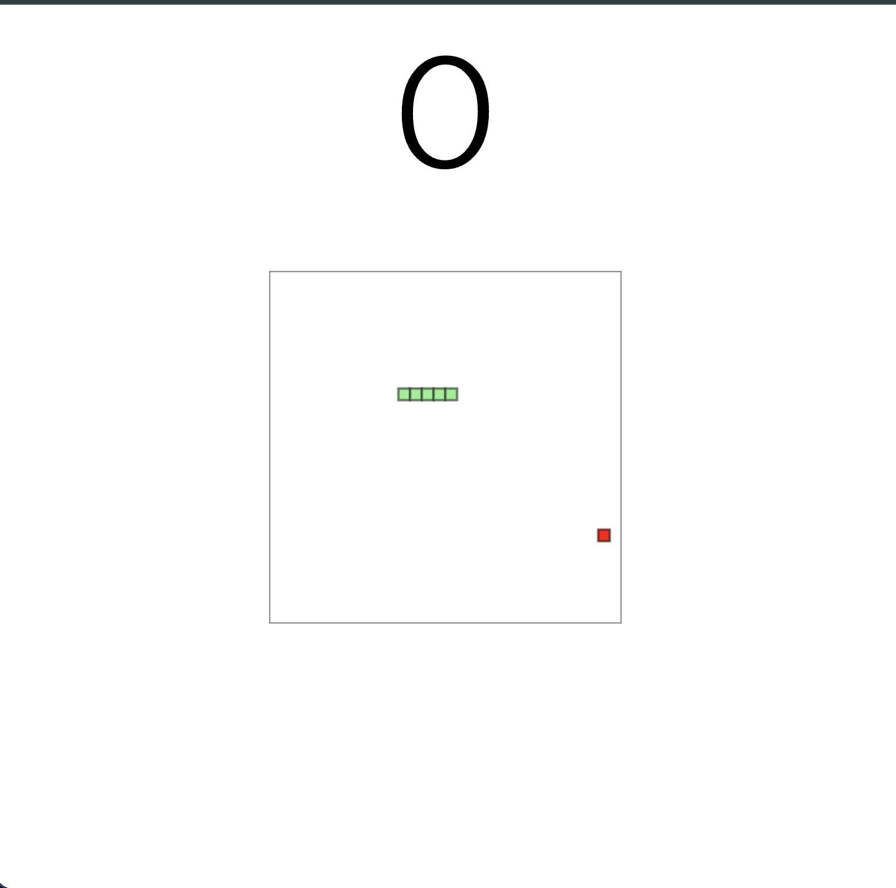
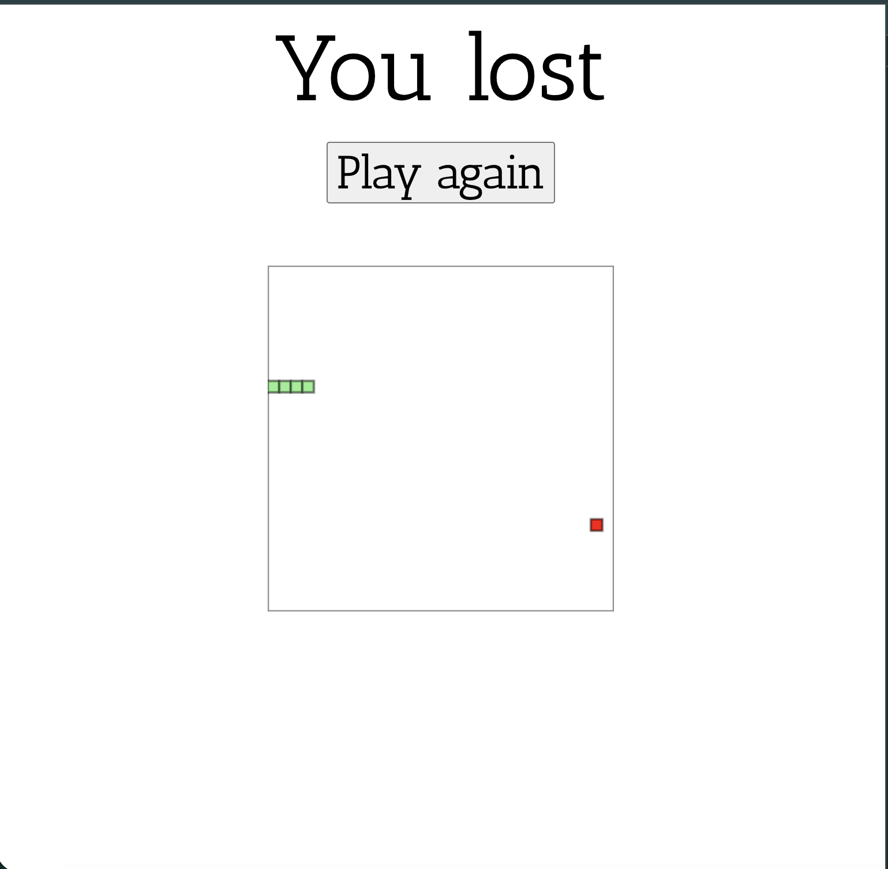

# Snake Game

## About This Project

As a kid, I loved playing Snake on phones and computers. There was something so satisfying about guiding that little snake, collecting food, and trying not to crash!

I decided to recreate this classic game as a personal project to practice **JavaScript**, **HTML5 Canvas**, and **DOM manipulation**. The goal was to build a simple, fun, and fully playable version of Snake that runs in any modern web browser.

## Features

- Classic Snake gameplay
- Dynamic score counter
- Food randomly spawns on the grid
- Detects collisions with walls and self
- Restart button after losing
- Keyboard controls (arrow keys)

## Screenshots

### Game Start

### Game Over

## How to Play

Open the `index.html` file in your favorite web browser.  
No installation is required.

Use the arrow keys to move the snake:

- ⬆️ Up
- ⬇️ Down
- ⬅️ Left
- ➡️ Right

Eat the red food to grow and score points. Avoid crashing into walls or yourself!

When you lose, click **Play again** to restart the game.

## Live Demo

Check out the game live here: [Live Demo Link](https://snake-mu-bice.vercel.app/)

## Technologies Used

- HTML5
- CSS3
- JavaScript (ES6)
- Canvas API

## License

This project is open source and available under the MIT License.

Made with ❤️ for anyone who loves Snake as much as I do!
